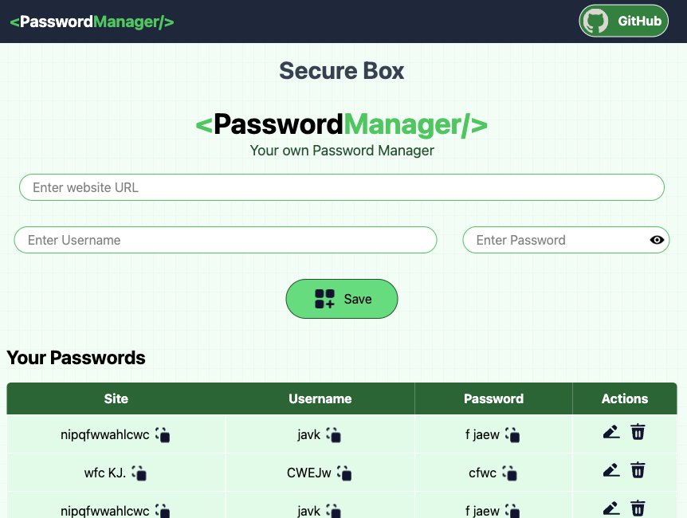
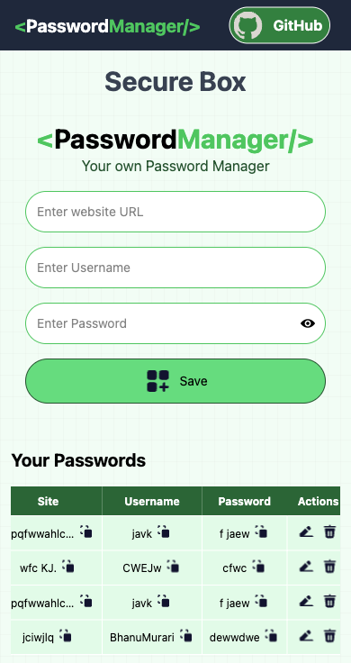

# 🔐 PassOP — Your Personal Password Manager

PassOP is a secure, minimalistic, and responsive password manager built with **React**, **Vite**, and **React Toastify**.  
It allows you to store, edit, copy, and manage your website credentials locally in your browser using `localStorage`.  

No server, no tracking — **your data stays on your machine**.

---

## ✨ Features

- **Store Credentials Locally**  
  Save website, username, and password directly in your browser's `localStorage`.

- **Copy-to-Clipboard**  
  Quickly copy any stored site, username, or password with one click.

- **Edit & Delete Support**  
  Update existing entries or remove them completely.

- **Toggle Password Visibility**  
  Show or hide passwords for easier editing.

- **Toast Notifications**  
  Beautiful, non-intrusive feedback using `react-toastify` for:
  - Successful saves  
  - Errors (validation, empty fields)  
  - Copy confirmation  
  - Deletions

- **Responsive & Modern UI**  
  Styled with Tailwind CSS for a clean and mobile-friendly interface.

---

## 🛠️ Tech Stack

| Technology       | Purpose                                      |
|------------------|----------------------------------------------|
| **React**        | Component-based UI                          |
| **Vite**         | Fast build & development server             |
| **React Toastify** | Elegant toast notifications                 |
| **UUID**         | Unique ID generation for stored passwords   |
| **Tailwind CSS** | Utility-first responsive styling            |
| **LocalStorage** | Client-side password storage (no backend)   |

---

## 📂 Project Structure

```
passwordManager/
│
├── src/
│ ├── components/
│ │ └── Manager.jsx # Main password manager component
│ ├── assets/ # Icons and static files
│ ├── App.jsx # Root app component
│ ├── main.jsx # Entry point
│ └── index.css # Tailwind styles
│
├── public/ # Public assets
├── package.json
└── README.md
```

For Cloning: 

```
git clone https://github.com/BhanuSankarasetty/Password-Manager
cd passop
```

2️⃣ Install Dependencies
```
npm install
```
- Cofigure Tailwindcss
3️⃣ Start the Development Server
```
npm run dev
```
4️⃣ Build for Production
```
npm run build
```

## 🔧 Environment & Setup Notes
Local Storage
All password data is stored in your browser’s localStorage. Clearing your browser data will remove stored passwords.

Security Disclaimer
This app is for personal use only. Since it stores data in localStorage without encryption, it is not suitable for storing sensitive, real-world passwords.

## 📸 Screenshots

 

 
